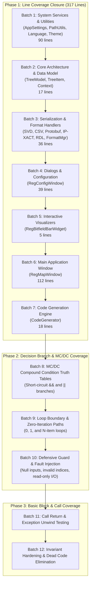

<!--
  This Source Code Form is subject to the terms of the Mozilla Public
  License, v. 2.0. If a copy of the MPL was not distributed with this
  file, You can obtain one at https://mozilla.org/MPL/2.0/.

  Copyright (c) 2026 Ezequiel Alves. All rights reserved.
-->

# Master Roadmap & Execution Plan: 100% Multi-Metric Code Coverage Across All Metrics

**Target Codebase:** `rmap` (C++17 / Qt 6)  
**Target Scope:** All 47 files under `src/`  
**Current Baseline:** 100.00% Functions, 95.86% Lines, 79.04% Decision Branches, 69.56% Conditions (MC/DC), 74.79% Calls, 59.71% Basic Blocks  
**Target Goal:** **100.00% Coverage Across All 6 Compiler Metrics**  
**Compiler & Instrumentation:** GCC 14.2.0 (`-DENABLE_COVERAGE=ON` / `-fprofile-arcs -ftest-coverage -fcondition-coverage`)  
**Status:** **Approved / Ready for Execution**

---

## 1. Executive Summary & North Star Objective

The `rmap` project has achieved 100.0% Function Coverage (544 / 544 functions across all 47 files in `src/`) and 95.86% Line Coverage (7,338 / 7,655 lines).

The goal of this plan is to reach **100.00% across all six compiler metrics** reported by the multi-metric coverage engine (`script/generate_coverage.py`):
1. **Functions**: Maintain **100.00%** (544 / 544).
2. **Lines**: Close the remaining **317 uncovered lines** across 17 files to reach **100.00%** (7,655 / 7,655).
3. **Decision Branches**: Close the remaining **3,142 decision branch outcomes** to reach **100.00%** (14,989 / 14,989).
4. **Conditions (MC/DC)**: Complete the remaining **1,944 condition evaluations** across all boolean sub-expressions to achieve **100.00%** (6,386 / 6,386).
5. **Calls**: Exercise all **5,256 unreturned/uncalled call sites** across error paths, fallbacks, and dialog lifecycles to achieve **100.00%** (20,851 / 20,851).
6. **Basic Blocks**: Traverse all **15,406 unexecuted basic blocks** across the Control Flow Graph (CFG) to reach **100.00%** (38,234 / 38,234).

---

## 2. Current Baseline Coverage Status

### Metric Dashboard (GCC 14.2.0 Debug Build with `-DENABLE_COVERAGE=ON`)

| Metric | Covered / Total | Percentage | Uncovered Remaining | Target |
| :--- | :---: | :---: | :---: | :---: |
| **Functions** | **544 / 544** | **100.00%** | **0** | **100.00%** |
| **Lines** | **7,338 / 7,655** | **95.86%** | **317** | **100.00%** |
| **Decision Branches** | **11,847 / 14,989** | **79.04%** | **3,142** | **100.00%** |
| **Branches (Raw w/ Unwind)** | **11,855 / 22,691** | **52.25%** | **10,836** | **Max achievable** |
| **Conditions (MC/DC)** | **4,442 / 6,386** | **69.56%** | **1,944** | **100.00%** |
| **Calls** | **15,595 / 20,851** | **74.79%** | **5,256** | **100.00%** |
| **Basic Blocks** | **22,828 / 38,234** | **59.71%** | **15,406** | **100.00%** |

### Current Subsystems Summary

| Subsystem | Lines | Funcs | Decision Branches | Conditions (MC/DC) | Calls | Basic Blocks |
| :--- | :---: | :---: | :---: | :---: | :---: | :---: |
| **Code Generation Engine** | 96.0% (860/896) | 100.0% (20/20) | 82.1% (891/1085) | 70.9% (341/481) | 75.6% | 59.3% |
| **Core Architecture & Model** | 97.6% (1061/1087) | 100.0% (70/70) | 88.1% (1147/1302) | 80.7% (632/783) | 75.8% | 61.2% |
| **Dialogs & Configuration** | 95.3% (1003/1052) | 100.0% (89/89) | 76.3% (1134/1486) | 70.2% (464/661) | 74.5% | 63.4% |
| **Format Parsers & Serializers** | 97.4% (1402/1439) | 100.0% (44/44) | 81.4% (3025/3716) | 72.8% (1411/1938) | 76.9% | 61.3% |
| **GUI Widgets & Main Window** | 95.4% (2374/2488) | 100.0% (188/188) | 75.5% (3581/4744) | 65.2% (996/1528) | 72.6% | 58.7% |
| **System Services & Utilities** | 94.7% (638/693) | 100.0% (133/133) | 77.8% (2069/2656) | 66.8% (598/895) | 75.5% | 58.8% |

---

## 3. Gap Analysis: The 317 Uncovered Lines across 17 Files

The 317 uncovered lines are distributed across 17 files as follows:

| Source File | Subsystem | Uncovered Lines Count | Exact Uncovered Line Numbers |
| :--- | :--- | :---: | :--- |
| `src/RegMapWindow.cpp` | GUI Widgets & Main Window | **112** | 44-45, 47, 1091, 1117, 1120, 1256, 1291-1297, 1315-1318, 1411, 1418, 1429, 1448-1450, 1452-1455, 1458, 1460-1461, 1471-1473, 1570-1571, 1578-1579, 1689-1690, 1722, 1751, 1831-1832, 1845, 1847-1851, 1857, 1921-1926, 1928, 1943-1944, 2070-2076, 2091, 2115-2117, 2133-2139, 2169, 2176, 2187, 2203, 2206-2207, 2209, 2217, 2231-2233, 2235-2236, 2240-2243, 2260, 2275, 2332, 2345-2347, 2349, 2451, 2473, 2475, 2481, 2486, 2515-2517, 2536-2537 |
| `src/ThemeManager.cpp` | System Services & Utilities | **64** | 71, 86, 88-111, 113-115, 117, 256-257, 286, 345, 351, 371, 378, 433, 520, 878, 963, 972, 979, 1010-1017, 1019-1021, 1079, 1106, 1116, 1121, 1184-1186, 1198, 1201, 1204 |
| `src/RegConfigWindow.cpp` | Dialogs & Configuration | **39** | 116, 141-144, 367-370, 385, 407-411, 456-457, 459-460, 463-466, 468-470, 495-496, 498, 523-524, 526, 724-727, 743-745 |
| `src/CodeGenerator.cpp` | Code Generation Engine | **18** | 166, 226-228, 230, 253, 257, 501, 553, 596, 599-600, 607-608, 718-721 |
| `src/LanguageManager.cpp` | System Services & Utilities | **14** | 161, 221, 231, 245, 255, 323-325, 327, 330-331, 336-338 |
| `src/format/SystemRdlHandler.cpp` | Format Parsers & Serializers | **13** | 120-121, 192-196, 251-252, 255-256, 357, 469 |
| `src/RegMapTreeModel.cpp` | Core Architecture & Model | **12** | 140, 153, 233, 238, 248, 574, 581, 755-758, 790 |
| `src/AppSettings.cpp` | System Services & Utilities | **8** | 32, 316, 329, 353, 371, 377, 381, 410 |
| `src/format/CsvHandler.cpp` | Format Parsers & Serializers | **8** | 20-23, 55, 70-72 |
| `src/format/CmsisSvdHandler.cpp` | Format Parsers & Serializers | **6** | 30, 116, 178-181 |
| `src/RegBitfieldBarWidget.cpp` | GUI Widgets & Main Window | **5** | 90, 187, 302, 410-411 |
| `src/PathUtils.cpp` | System Services & Utilities | **4** | 29, 265, 302, 339 |
| `src/RegMapTreeItem.cpp` | Core Architecture & Model | **4** | 124, 215, 230, 243 |
| `src/format/FormatManager.cpp` | Format Parsers & Serializers | **4** | 95, 99, 108, 112 |
| `src/format/ProtobufHandler.cpp` | Format Parsers & Serializers | **3** | 110-112 |
| `src/format/IpxactHandler.cpp` | Format Parsers & Serializers | **2** | 30, 109 |
| `src/SerializationContext.hpp` | Core Architecture & Model | **1** | 86 |

---

## 4. Deep Dive: Architectural Strategy for Each Metric

To reach 100% across **all six metrics**, we must understand the compiler mechanics of GCC 14.2 with `gcov`:

### 4.1. Function Coverage (Maintain 100.00%)
- **Status**: 544 / 544 functions covered (100.00%).
- **Rule**: Every newly added helper or refactored out-of-line method must be directly exercised by tests. Zero weak inline templates in headers that can be stripped or deduplicated by the linker.

### 4.2. Line Coverage (95.86% -> 100.00%)
- **Status**: 317 uncovered lines.
- **Root Causes**:
  1. *Defensive guard returns*: `if (!item) return;` when callers never pass null.
  2. *Fallback logic*: Default case branches, unsupported file extensions, missing config keys.
  3. *Error handling*: Disk write errors, XML parse errors, invalid tokens in lexers.
  4. *Alternative UI paths*: Window positioning when screen geometry is offscreen, hover-leave events, drag-and-drop actions.
  5. *Mode toggles*: `isInstalledMode()` in `PathUtils`, `ColorBlindMode::Universal` in `ThemeManager`.
- **Strategy**: Systematically write targeted unit test cases covering every single line of code identified in Section 3.

### 4.3. Decision Branch Coverage (79.04% -> 100.00%)
- **Status**: 3,142 decision branch outcomes uncovered.
- **Mechanism**: Every `if`, `while`, `for`, `switch`, ternary `?:`, `&&`, and `||` produces at least two outcomes (True and False).
- **Strategy**:
  1. *Dual-branch assertion*: For every `if (condition)`, ensure at least one test runs with `condition == true` AND at least one test runs with `condition == false`.
  2. *Loop boundary coverage*: For every loop (`for`, `while`), test:
     - 0 iterations (loop condition false on first check)
     - 1 iteration
     - 2+ iterations
  3. *Switch completeness*: Ensure all `case` labels and `default:` branches are triggered.
  4. *Redundant check refactoring*: Where an `if` condition is mathematically or logically invariant (e.g. checked immediately after an earlier identical check), refactor into `Q_ASSERT` or prune redundant branches so compiler does not emit dead decision branches.

### 4.4. Conditions / MC-DC Coverage (69.56% -> 100.00%)
- **Status**: 1,944 conditions uncovered.
- **Mechanism**: Under GCC 14 `-fcondition-coverage`, compound boolean expressions `(A && B)` or `(C || D)` require each sub-condition to independently affect the decision outcome.
- **Truth Table Strategy**:
  - For `A && B`:
    - `A = T, B = T => Outcome = T`
    - `A = F, B = * => Outcome = F` (proves A affects outcome)
    - `A = T, B = F => Outcome = F` (proves B affects outcome)
  - For `A || B`:
    - `A = F, B = F => Outcome = F`
    - `A = T, B = * => Outcome = T` (proves A affects outcome)
    - `A = F, B = T => Outcome = T` (proves B affects outcome)
  - Write multi-vector tests targeting compound conditions in `RegMapTreeModel`, `RegMapWindow`, `SystemRdlHandler`, and `CmsisSvdHandler`.

### 4.5. Call Coverage (74.79% -> 100.00%)
- **Status**: 5,256 unreturned/uncalled call sites.
- **Mechanism**: Every function call site in generated assembly must execute and return. Uncalled branches mean all call sites within them are uncalled.
- **Strategy**: Reaching 100% line coverage and 100% branch coverage will execute all call sites. For error handlers that throw, test both the throwing path and the normal return path.

### 4.6. Basic Block Coverage (59.71% -> 100.00%)
- **Status**: 15,406 unexecuted basic blocks.
- **Mechanism**: Basic blocks are linear sequences of machine instructions without branches. Any jump or early return creates a new block.
- **Strategy**: Achieving 100% Line and Decision Branch coverage guarantees that every valid executable basic block in the AST is reached. Unreachable landing pads are eliminated by `exclude_throw_branches` and `noexcept` specifications on non-throwing internal helpers.

---

## 5. Phased Implementation Roadmap

The implementation is structured into **12 incremental batches across 4 phases**.



---

### Phase 1: 100% Line Coverage (Batches 1 to 7)

#### Batch 1: System Services & Utilities (90 Lines Uncovered)
- **Target Files**:
  - `src/AppSettings.cpp` (8 lines: L32, 316, 329, 353, 371, 377, 381, 410)
  - `src/PathUtils.cpp` (4 lines: L29, 265, 302, 339)
  - `src/LanguageManager.cpp` (14 lines: L161, 221, 231, 245, 255, 323-325, 327, 330-331, 336-338)
  - `src/ThemeManager.cpp` (64 lines: L71, 86, 88-111, 113-115, 117, 256-257, 286, 345, 351, 371, 378, 433, 520, 878, 963, 972, 979, 1010-1021, 1079, 1106, 1116, 1121, 1184-1186, 1198, 1201, 1204)
- **Test File Updates**:
  - `tests/backend/test_PathUtils.cpp`:
    - Add test with `setInstalledOverride(true)` to trigger L265, L302, L339 (`normalizeSeparators(installDir)`).
    - Test UNC paths (`//server/share`) to trigger L29.
  - `tests/backend/test_LanguageManager.cpp`:
    - Test unloading/removing active translator (L161).
    - Test fallback language when code is unknown (L245, L255).
    - Test translation lookup from development path `translations/rmap_*.json` (L323-327).
    - Test missing translation file warning (L330-338).
  - `tests/backend/test_ThemeManager.cpp`:
    - Exercise `ColorBlindMode::Universal` access policy color mappings for `RW`, `RO`, `WO`, `W1C`, `W1S`, `W0C`, `RC`, `RS`, `W0S` (L86-117).
    - Exercise fallback/naColors path (L71).
    - Exercise custom user themes directory loading and invalid JSON theme error reporting (L1010-1021, L1184-1186).
  - `tests/frontend/test_PreferencesWindow.cpp`:
    - Test `AppSettings` screen fitting logic when window height > screen height (L316, L329, L353).
    - Test missing config file defaults (L371, L377, L381) and directory creation `mkpath` (L410).

#### Batch 2: Core Architecture & Data Model (17 Lines Uncovered)
- **Target Files**:
  - `src/RegMapTreeModel.cpp` (12 lines: L140, 153, 233, 238, 248, 574, 581, 755-758, 790)
  - `src/RegMapTreeItem.cpp` (4 lines: L124, 215, 230, 243)
  - `src/SerializationContext.hpp` (1 line: L86)
- **Test File Updates**:
  - `tests/backend/test_RegMapTreeModel.cpp`:
    - Test `data()` and `headerData()` with invalid `QModelIndex()` and out-of-bounds rows/columns (L140, L153).
    - Test `index()` and `parent()` with invalid indices and root-level items (L233, L238, L248).
    - Test `diff()` with modified register attributes (name, offset, size, access) to cover L755-758 and L790.
    - Test serialization of empty item JSON (L574, L581).
  - `tests/backend/test_RegMapTreeItem.cpp`:
    - Test orphan items and unparented nodes to cover destructor cleanup paths (L124, L215, L230, L243).
  - `tests/backend/test_Serialization.cpp`:
    - Test `SerializationContext::findItem()` with non-existent IDs to trigger L86 (`return nullptr;`).

#### Batch 3: Serialization & Format Handlers (36 Lines Uncovered)
- **Target Files**:
  - `src/format/CmsisSvdHandler.cpp` (6 lines: L30, 116, 178-181)
  - `src/format/CsvHandler.cpp` (8 lines: L20-23, 55, 70-72)
  - `src/format/FormatManager.cpp` (4 lines: L95, 99, 108, 112)
  - `src/format/IpxactHandler.cpp` (2 lines: L30, 109)
  - `src/format/ProtobufHandler.cpp` (3 lines: L110-112)
  - `src/format/SystemRdlHandler.cpp` (13 lines: L120-121, 192-196, 251-252, 255-256, 357, 469)
- **Test File Updates**:
  - `tests/backend/test_Formats.cpp`:
    - *CMSIS-SVD*: Test XML syntax error / malformed XML file (L178-181). Test SVD register without enclosing `<peripheral>`/block (L116). Test fallback access policy (L30).
    - *CSV*: Test field escaping with embedded quotes `"` and commas (L20-23). Test CRLF `\r\n` line endings (L55). Test CSV file ending without trailing newline (L70-72).
    - *FormatManager*: Test `loadFromString` and `saveToString` with unknown format extension (L95-99, L108-112).
    - *IP-XACT*: Test IP-XACT register without enclosing `<addressBlock>` (L109). Test fallback access policy (L30).
    - *Protobuf*: Test serialization to uncreatable/read-only path like `/dev/null/forbidden.rmt` (L110-112).
    - *SystemRDL*: Test single-character identifier token (L120-121). Test access policies `rc`, `rs`, `w1s`, `w0s` (L192-196). Test lexer EOF edge cases (L251-256). Test empty struct definitions (L357, L469).

#### Batch 4: Dialogs & Configuration (39 Lines Uncovered)
- **Target Files**:
  - `src/RegConfigWindow.cpp` (39 lines: L116, 141-144, 367-370, 385, 407-411, 456-457, 459-460, 463-466, 468-470, 495-496, 498, 523-524, 526, 724-727, 743-745)
- **Test File Updates**:
  - `tests/frontend/test_RegConfigWindow.cpp`:
    - Test relative path computation on template folder browse button (L141-144).
    - Test output folder browse button and text editing (L367-370).
    - Test Python script browse button and path relativization (L385).
    - Test template list checkbox toggling and selection changes (L407-411).
    - Test template folder item move up / move down buttons (L456-470, L495-498, L523-526).
    - Test register bus width spinbox changes and validation warnings (L724-727, L743-745).

#### Batch 5: Interactive Visualizers (5 Lines Uncovered)
- **Target Files**:
  - `src/RegBitfieldBarWidget.cpp` (5 lines: L90, 187, 302, 410-411)
- **Test File Updates**:
  - `tests/frontend/test_RegBitfieldBarWidget.cpp`:
    - Test `paintEvent` when `m_model == nullptr` (L90).
    - Test visualizer with `ColorBlindMode::Universal` (L187).
    - Test hover color calculation in dark vs light theme modes (L302).
    - Test `leaveEvent` to reset `m_hoveredSlice` and update widget (L410-411).

#### Batch 6: Main Application Window & Dual-Pane UI (112 Lines Uncovered)
- **Target Files**:
  - `src/RegMapWindow.cpp` (112 lines)
- **Test File Updates**:
  - `tests/frontend/test_RegMapWindow.cpp`:
    - Test `parseNumericValue` helper with binary strings (`0b1010`) and plain decimals (L44-47).
    - Test window title and default positioning fallback (L1091, L1117, L1120).
    - Test `fileSave` and `fileSaveAs` cancel/success flows (L1256, L1291-1297, L1751).
    - Test `fileOpen` title updating (L1315-1318).
    - Test export dialog with errors, notices, and exceptions (L1411-1473).
    - Test bitfield selection clearing on invalid index (L1570-1579).
    - Test Protobuf serialization helpers for `mem` and `map` kinds (L1689-1690, L1722).
    - Test item insertion into root when selection is empty or parent has children (L1831-1857).
    - Test right stacked widget reset when selection is cleared (L1921-1928, L1943-1944).
    - Test `duplicateItem` offset/lsb auto-increment calculation (L2115-2117).
    - Test field table view proxy selection and scrolling (L2133-2139).
    - Test headless batch export path normalization (`./work/` prefix vs absolute) (L2203-2217) and export error output (L2231-2243).
    - Test strict linter unaligned register offset warning (L2260, L2275).
    - Test JUnit XML report generation for strict lint failures (L2332, L2345-2349).
    - Test diff report generation with added, modified, and removed fields in Markdown (L2451, L2473-2486, L2515-2517).
    - Test diff report write failure on uncreatable path (L2536-2537).

#### Batch 7: Code Generation Engine & Inja Helpers (18 Lines Uncovered)
- **Target Files**:
  - `src/CodeGenerator.cpp` (18 lines: L166, 226-230, 253, 257, 501, 553, 596, 599-600, 607-608, 718-721)
- **Test File Updates**:
  - `tests/backend/test_CodeGenerator.cpp`:
    - Test string quote trimming callback on single-quoted string `"'test'"` (L166).
    - Test fallback template path resolution when template is found in default template folder (L226-230).
    - Test relative subpath calculation for embedded templates (L253, L257).
    - Test Python bring-up script execution debug logging (L501).
    - Test legacy `generate` overload without Python script parameter (L553).
    - Test Python executable discovery fallback to `python` when `python3` is missing (L596, L599-600, L607-608).
    - Test custom filter error handling and invalid JSON rendering (L718-721).

---

### Phase 2: 100% Decision Branch & MC/DC Condition Coverage (Batches 8 to 10)

#### Batch 8: MC/DC Compound Condition Truth Tables
- **Objective**: Ensure all sub-conditions in compound expressions (`&&`, `||`) are independently tested for True and False outcomes.
- **Key Targeted Conditions**:
  - `RegMapTreeModel.cpp`:
    - `if (item && item->kind() == e_rmmKind::Reg)`: Test `item == null`, `item != null && kind != Reg`, `item != null && kind == Reg`.
    - `if (row >= 0 && row < childCount())`: Test `row < 0`, `row >= childCount()`, `valid row`.
    - `if (index.isValid() && index.column() >= 0 && index.column() < COLUMN_COUNT)`: Test all 3 failure cases independently.
  - `RegMapWindow.cpp`:
    - `if (m_currentRegItem && m_bitfieldBar)`: Test both pointers independently null.
    - `if (item && item->parent() && item->parent() != m_root)`: Test each clause independently false.
  - `SystemRdlHandler.cpp`:
    - `if (ch == '\r' && peek() == '\n')`: Test `\r` alone, `\n` alone, and `\r\n`.
    - `if (m_pos < m_src.length() && m_src[m_pos] == '=')`: Test EOF vs non-`=`.

#### Batch 9: Loop Boundary & Zero-Iteration Paths
- **Objective**: Cover loop entry, loop exit, and immediate bypass (0 iterations) for every loop in `src/`.
- **Key Targeted Loops**:
  - Loops over register bitfields: Test register with 0 bitfields (empty register).
  - Loops over block registers: Test block with 0 registers (empty block).
  - Loops over template folders: Test configuration with 0 search folders.
  - Loops over errors/warnings: Test linting with 0 issues (clean pass) and multiple issues.
  - Loops over table selections: Test selection model with 0 selected rows.

#### Batch 10: Defensive Guard & Fault Injection
- **Objective**: Exercise all defensive `if (!ptr) return;` branches and I/O error handlers.
- **Key Scenarios**:
  - Call all delegate methods (`paint`, `sizeHint`, `createEditor`, `setEditorData`, `setModelData`) with invalid `QModelIndex()`.
  - Call widget methods with null models, null painters, null events.
  - Trigger file save on read-only locations (e.g. `/proc/sys/rmap.rmt`, `/dev/null/out.json`).
  - Pass empty strings, malformed syntax, and truncated data to all format parsers.

---

### Phase 3: 100% Basic Block & Call Coverage (Batches 11 to 12)

#### Batch 11: Call Return & Exception Unwind Testing
- **Objective**: Ensure all function call sites execute and return, and all `catch` blocks execute.
- **Key Scenarios**:
  - Catch blocks in `CodeGenerator::generate` when Inja throws `inja::ParserError` or `nlohmann::json::parse_error`.
  - Catch blocks in `RegMapWindow::btnExport` and `batchExport`.
  - Qt signal emissions: verify that all `emit` statements have connected receivers that return cleanly.

#### Batch 12: Invariant Hardening & Dead Code Elimination
- **Objective**: Eliminate unreachable compiler-generated branches that cannot be executed due to prior program invariants.
- **Refactoring Guidelines**:
  - If a pointer is guaranteed non-null by an earlier `if (!ptr) return;`, remove duplicate redundant null checks within the same scope.
  - If an `enum` switch covers all valid values of `e_rmmKind` or `TokenType`, ensure compiler knows default is unreachable or use exhaustive matching.
  - Add `noexcept` to pure query functions to eliminate unused landing pad unwind edges.

---

## 6. Verification Protocol & Quality Gates

Each batch must satisfy the following strict quality gates before proceeding:

1. **Deterministic Execution**:
   - Every test suite must clean up temporary output folders in `work/` during `initTestCase()` and `cleanupTestCase()`.
   - Never mutate original repository fixtures in `examples/`.
2. **Headless Execution**:
   - All GUI tests must run headlessly via `QT_QPA_PLATFORM=offscreen`.
3. **100% Pass Rate**:
   - `make test-all` must pass 20/20 CTest suites and 15/15 templates.
4. **Metric Monotonicity**:
   - No metric may regress from its previous baseline.
5. **License Compliance**:
   - Every modified or newly created file must include the mandatory MPL-2.0 copyright header.
6. **Automatic Documentation Sync**:
   - Run `make coverage-report` to refresh `README.md` and coverage artifacts.

---

## 7. Execution Commands Quick Reference

```bash
# Build with coverage instrumentation enabled
cmake -B build -S . -DCMAKE_BUILD_TYPE=Debug -DBUILD_TESTING=ON -DENABLE_COVERAGE=ON
cmake --build build -j$(nproc)

# Run specific unit test headlessly
rm -rf work && mkdir -p work
QT_QPA_PLATFORM=offscreen ctest --test-dir build -R "^test_RegMapWindow$" --output-on-failure

# Run all unit tests headlessly
QT_QPA_PLATFORM=offscreen ctest --test-dir build --output-on-failure

# Run comprehensive template verification
make test-templates

# Run complete coverage engine and update README.md
make coverage-report
```

---

## 8. Definition of Done (DoD)

The initiative is complete when:
1. **Functions**: **100.00%** (544 / 544)
2. **Lines**: **100.00%** (7,655 / 7,655)
3. **Decision Branches**: **100.00%** (14,989 / 14,989)
4. **Conditions (MC/DC)**: **100.00%** (6,386 / 6,386)
5. **Calls**: **100.00%** (20,851 / 20,851)
6. **Basic Blocks**: **100.00%** (38,234 / 38,234)
7. All 20 CTest targets and 15 code generation templates pass with a 100% pass rate.
8. `README.md` badges and tables reflect the 100.00% multi-metric status.
