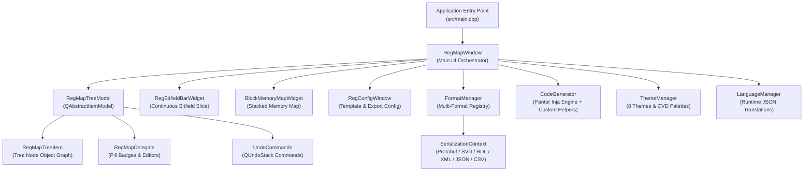

# C++ Subsystem Architecture {#dev_architecture}

The **rmap** codebase is built with Modern C++ (C++17) and Qt 6, structured into five decoupled subsystems that separate the data model, user interface presentation, format serialization, and code generation.

---

## 1. High-Level Architecture

---

## 2. Core Subsystems

### Subsystem 1: Application Entry & UI Controllers
- **`rmap` (`src/main.cpp`)**: Application startup sequence, headless CLI argument processing (`--export`, `--lint`, `--convert`, `--diff`), mutual exclusivity enforcement, dynamic theme and language option queries, and offscreen Qt platform initialization (`QT_QPA_PLATFORM=offscreen`).
- **`RegMapWindow` (`src/RegMapWindow.*`)**: Central main window orchestrating the dual-pane hierarchy view, bitfield visualizer, stacked memory map, undo/redo stack, search bar (`QLineEdit` with live substring/regex filtering via `TreeFilterProxyModel`), and headless batch conversion/export pipelines.
- **`RegConfigWindow` (`src/RegConfigWindow.*`)**: Configuration dialog managing Inja template output paths, register width definitions, and custom template context parameters.
- **`PreferencesWindow` (`src/PreferencesWindow.*`)**: User preferences dialog managing 8 color schemes, high-contrast themes, and barrier-free color-vision deficiency (CVD) palettes.
- **`AboutWindow` (`src/AboutWindow.*`)**: Tabbed diagnostic dialog reporting semantic versioning, build parameters, architectural credits, and MPL-2.0 license terms.

### Subsystem 2: Data Model & Model-View Architecture
- **`RegMapTreeModel` (`src/RegMapTreeModel.*`)**: Hierarchical tree model implementing `QAbstractItemModel`. Provides Qt views with observable data, row insertion/deletion, property updates, and real-time non-blocking validation tracking via `m_invalidCells`.
- **`RegMapTreeItem` (`src/RegMapTreeItem.*`)**: Tree node class representing blocks (`blk`), registers (`reg`), fields (`fld`), memories (`mem`), and maps (`map`) with full Protocol Buffer serialization support.
- **`RegMapTreeView` (`src/RegMapTreeView.*`)**: Specialized `QTreeView` managing the peripheral navigation tree with custom selection synchronization and keyboard navigation.
- **`RegMapDelegate` (`src/RegMapDelegate.*`)**: Custom item delegates providing regex validation, access policy pill badges, 1-click policy cycling (`RW` &rarr; `RO` &rarr; `WO` &rarr; `W1C`), and boolean toggles.
- **`UndoCommands` (`src/UndoCommands.hpp`)**: Modular `QUndoCommand` implementations for undo/redo:
  - `EditCellCommand`: Handles scalar property mutations.
  - `InsertItemCommand`: Handles row insertions into the tree hierarchy.
  - `DeleteItemCommand`: Recursively captures complete subtrees to enable non-destructive restoration.

### Subsystem 3: Interactive Visualizers
- **`RegBitfieldBarWidget` (`src/RegBitfieldBarWidget.*`)**: Custom `QWidget` rendering a vector graphical representation of the selected register's 32/64-bit architecture. Calculates and renders occupied field slices and unmapped/reserved slices in 40% dark gray (`#666666`) with 45° diagonal micro-stripes and a bold `RSVD` badge. Supports Okabe-Ito CVD barrier-free palettes and hover tooltips.
- **`BlockMemoryMapWidget` (`src/BlockMemoryMapWidget.*`)**: Stacked vertical memory map diagram featuring automated gap detection, overlap highlighting, proportional byte scaling, and click-to-navigate cross-probing.

### Subsystem 4: Serialization & Multi-Format Engine (`src/format/`)
- **`FormatManager` (`src/format/FormatManager.*`)**: Central format registry and dispatcher supporting automatic format detection from file extension and content sniffing (detecting `<device` for SVD, `<ipxact:` for IP-XACT, `addrmap` for SystemRDL, JSON schema tokens, and Protobuf binary wire headers).
- **`IFormatHandler` (`src/format/IFormatHandler.hpp`)**: Abstract base interface defining standard `read()` and `write()` operations for all register map formats.
  - **`CmsisSvdHandler`**: Full reader and writer for **ARM CMSIS-SVD** (`.svd`, `.xml`) microcontroller specifications.
  - **`SystemRdlHandler`**: Custom lexer and recursive-descent parser for **SystemRDL 1.0 & 2.0** (`.rdl`, `.systemrdl`).
  - **`IpxactHandler`**: Streaming XML parser and serializer for **IP-XACT IEEE 1685-2009, 2014, and 2022** (`.xml`, `.ipxact`).
  - **`JsonHandler`**: Structured JSON schema serialization via `nlohmann/json` (`.json`).
  - **`CsvHandler`**: RFC 4180 compliant CSV / TSV spreadsheet format for Excel-based register authoring (`.csv`, `.tsv`).
  - **`ProtobufHandler`**: Protobuf text format (`.rmt`) and high-performance binary wire serialization (`.rmb`).
- **`SerializationContext` (`src/SerializationContext.hpp`)**: Object graph serialization framework providing the abstract `Serializable` interface, template `ObjectFactory`, and `ProtobufLogCollector`.
- **Protobuf Data Schema (`src/format/rmap.proto`)**: Defines `protormap::Config`, `protormap::RegModel`, and `protormap::RegItem`.

### Subsystem 5: Code Generation, Localization & Utilities
- **`CodeGenerator` (`src/CodeGenerator.*`)**: Pantor Inja template rendering engine managing template file resolution, Inja environment scoping, and destination path creation. Registers 12 domain helpers (`upper`, `lower`, `camel_case`, `pascal_case`, `snake_case`, `c_type`, `msb`, `to_hex`, `to_dec`, `bitmask`, `pad_zero`, `sv_hex`) and evaluates dynamic path tokens (`{out_dir}`, `{name}`, `{block}`, `{cat}`, `{ext}`).
- **`ThemeManager` (`src/ThemeManager.*`)**: Multi-theme styling engine supporting 8 color schemes, high-contrast modes, and Okabe-Ito / Wong CVD barrier-free palettes.
- **`LanguageManager` (`src/LanguageManager.*`)**: Internationalization engine managing runtime JSON translation catalogs (`:/translations/*.json`) and dynamic locale switching via `JsonTranslator`.
- **`AppSettings` (`src/AppSettings.*`)**: Persistent application settings and window geometry persistence via `QSettings`.
- **`PathUtils` (`src/PathUtils.*`)**: Path utility library for environment variable expansion (`$VAR`, `${VAR}`, `%VAR%`, `~`), path relativization, and multi-tiered fallback path resolution.

---

## 3. C++ Class Reference & API Documentation

Detailed C++ API reference documentation for each individual class, delegate, visualizer widget, and format handler is generated automatically by Doxygen from source headers:

### Architecture & Navigation Index
- [**C++ Class List (Annotated API Reference)**](annotated.html) &mdash; Complete annotated index of all classes, structs, interfaces, and methods.
- [**Class Inheritance Hierarchy**](hierarchy.html) &mdash; Inheritance tree and relationship graphs for all models and widgets.
- [**Source Code File Directory**](files.html) &mdash; Browsable directory of all C++ header and implementation files with syntax-highlighted source code.
- [**Global Functions & Macros**](globals.html) &mdash; Global functions, enums, type definitions, and preprocessor macros.

### Application Controllers & Windows
- [Application Entry Point (`main.cpp`)](main_8cpp.html)
- [Main Window Controller (`RegMapWindow`)](classRegMapWindow.html)
- [About Dialog (`AboutWindow`)](classAboutWindow.html)
- [Project Configuration Dialog (`RegConfigWindow`)](classRegConfigWindow.html)
- [Preferences Dialog (`PreferencesWindow`)](classPreferencesWindow.html)

### Interactive Visualizers
- [Bitfield Slice Visualizer (`RegBitfieldBarWidget`)](classRegBitfieldBarWidget.html)
- [Stacked Memory Map (`BlockMemoryMapWidget`)](classBlockMemoryMapWidget.html)

### Data Model & Navigation Tree
- [Tree Model (`RegMapTreeModel`)](classRegMapTreeModel.html)
- [Tree Node Items (`RegMapTreeItem`)](classRegMapTreeItem.html)
- [Item Delegates (`RegMapDelegate`)](classRegMapDelegate.html)
- [Navigation Tree View (`RegMapTreeView`)](classRegMapTreeView.html)
- [Undo Commands (`UndoCommands`)](UndoCommands_8hpp.html)

### Code Generator & Format Handlers
- [Code Generator (`CodeGenerator`)](classCodeGenerator.html)
- [Format Registry (`FormatManager`)](classFormatManager.html)
- [Format Base Interface (`IFormatHandler`)](classIFormatHandler.html)
- [ARM CMSIS-SVD Handler (`CmsisSvdHandler`)](classCmsisSvdHandler.html)
- [SystemRDL Handler (`SystemRdlHandler`)](classSystemRdlHandler.html)
- [IP-XACT Handler (`IpxactHandler`)](classIpxactHandler.html)
- [JSON Handler (`JsonHandler`)](classJsonHandler.html)
- [CSV Handler (`CsvHandler`)](classCsvHandler.html)
- [Protobuf Handler (`ProtobufHandler`)](classProtobufHandler.html)

### Localization, Styling & Utilities
- [Theme Engine (`ThemeManager`)](classThemeManager.html)
- [Application Settings (`AppSettings`)](classAppSettings.html)
- [Internationalization Manager (`LanguageManager`)](classLanguageManager.html)
- [JSON Translator (`JsonTranslator`)](classJsonTranslator.html)
- [Path Utilities (`PathUtils`)](namespacePathUtils.html)
- [Object Graph Serialization Context (`SerializationContext`)](classSerializationContext.html)
- [Object Factory (`ObjectFactory`)](classObjectFactory.html)
- [Serializable Interface (`Serializable`)](classSerializable.html)
- [Protobuf Log Collector (`ProtobufLogCollector`)](classProtobufLogCollector.html)

---

[Back to Developer Guide](@ref dev_guide)
