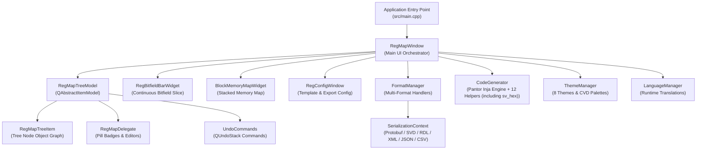

# rmap C++ Subsystem Architecture & API Reference

Welcome to the **rmap** developer reference documentation. This portal provides an architectural overview of the core C++ subsystems and serves as the entry point for the automated **Doxygen C++ API reference**.

---

## Automated Doxygen API Documentation

All class interfaces, method signatures, signals, slots, inheritance hierarchies, and data structures are documented directly within the C++ source headers (`src/` and `src/format/`) using Doxygen docstrings. 

Rather than maintaining manual Markdown files for individual classes, documentation is automatically extracted and rendered by Doxygen.

### Browsing the API Documentation
- [**C++ Class List (API Reference)**](annotated.html): Complete annotated index of all classes, structs, interfaces, and methods.
- [**Class Inheritance Hierarchy**](hierarchy.html): Inheritance tree and relationship graphs for all models and widgets.
- [**Source Code File List**](files.html): Complete browsable directory of all C++ header and implementation files with syntax-highlighted source code.
- [**Global Functions & Macros**](globals.html): Global functions, enums, type definitions, and preprocessor macros.

### Generating Doxygen Documentation
To generate or refresh the Doxygen C++ API documentation:
```bash
# Via project Makefile
make docs-doxygen

# Or directly with doxygen
doxygen docs/Doxyfile
```

The rendered HTML documentation is generated directly into the root documentation portal `_site/`.


> [!IMPORTANT]
> **Prerequisites**: Doxygen is required to build developer API documentation.
> - **Ubuntu/Debian**: `sudo apt-get install -y doxygen graphviz`
> - **macOS**: `brew install doxygen graphviz`
> - **Fedora/RHEL**: `sudo dnf install doxygen graphviz`
> - **Arch Linux**: `sudo pacman -S doxygen graphviz`

---

## Subsystem Architecture Overview

The `rmap` codebase is structured into five core subsystems:



### 1. Application & UI Controllers
- **`rmap` (`src/main.cpp`)**: Application startup sequence, headless CLI argument processing (`-e`, `-l`, `-c`, `-d`), dynamic theme and language option queries, and Qt GUI initialization.
- **`RegMapWindow`**: Central main window orchestrating the dual-pane hierarchy view, bitfield visualizer, stacked memory map, undo/redo stack, and headless conversion/export pipelines.
- **`RegConfigWindow`**: Non-modal configuration dialog managing Inja template output paths, register width definitions, and custom template context parameters.
- **`PreferencesWindow`**: User preferences dialog managing 8 color schemes, high-contrast themes, and barrier-free color-vision deficiency (CVD) palettes.
- **`AboutWindow`**: Diagnostic and version information dialog reporting semantic versioning, build parameters, and open-source licenses.

### 2. Data Model & Model-View Contract
- **`RegMapTreeModel`**: Hierarchical 11-column tree model implementing `QAbstractItemModel` with real-time architectural validation, invalid cell tracking, and JSON data extraction.
- **`RegMapTreeItem`**: Core tree node class representing blocks, registers, fields, memories, and maps with Protocol Buffer serialization support.
- **`RegMapTreeView`**: Specialized `QTreeView` managing the peripheral navigation tree with custom selection synchronization and focus handling.
- **`RegMapDelegate`**: Fast item delegates providing regex validation, access policy pill badges, 1-click cycling, and boolean toggles.
- **`UndoCommands`**: Modular `QUndoCommand` implementations for cell edits, row insertions, and deep recursive subtree deletions.

### 3. Interactive Visualizers
- **`RegBitfieldBarWidget`**: Continuous 32/64-bit register slice visualizer featuring unmapped reserved slot hatching, hover tooltips, and bidirectional table selection.
- **`BlockMemoryMapWidget`**: Stacked vertical memory map diagram featuring automated gap detection, overlap highlighting, and click-to-navigate cross-probing.

### 4. Serialization & Format Engine
- **`FormatManager`**: Central multi-format registry and dispatcher supporting ARM CMSIS-SVD, Accellera SystemRDL 1.0/2.0, IP-XACT IEEE 1685, JSON, CSV/TSV, and Google Protobuf (`.rmt`, `.rmb`).
- **`SerializationContext`**: Object graph serialization framework providing the abstract `Serializable` interface, template `ObjectFactory`, and `ProtobufLogCollector`.

### 5. Code Generation, Localization & Utilities
- **`CodeGenerator`**: Pantor Inja template rendering engine featuring 12 custom naming and bitwise helper callbacks (including sv_hex) for multi-target code generation (SystemVerilog, Verilog, VHDL, UVM, C, Rust, Python).
- **`ThemeManager`**: Multi-theme styling engine supporting 8 color schemes and Okabe-Ito / Wong CVD barrier-free palettes.
- **`LanguageManager`**: Internationalization engine managing runtime JSON translation catalogs (`.json`) and dynamic locale switching via `JsonTranslator`.
- **`AppSettings`**: Persistent application settings and window geometry persistence via `QSettings`.
- **`PathUtils`**: Path utility library for environment variable expansion, path relativization, and multi-tiered fallback path resolution.

---

## Code Documentation Standards for Developers

To ensure Doxygen generates complete and accurate API documentation, developers must follow these formatting standards in all C++ headers:

```cpp
/**
 * @class ExampleManager
 * @brief Thread-safe singleton managing subsystem lifecycle and configuration.
 *
 * Details on the internal architecture, thread safety invariants, and Qt
 * model-view integration contracts.
 */
class ExampleManager : public QObject {
    Q_OBJECT

public:
    /**
     * @brief Retrieve the global singleton instance.
     * @return Reference to the singleton instance.
     */
    static ExampleManager &instance();

    /**
     * @brief Register a new format handler.
     * @param format Extension or format identifier (e.g. "svd").
     * @param handler Owning pointer to the format handler.
     * @return True if registration succeeded without conflict.
     */
    bool registerHandler(const QString &format, std::unique_ptr<FormatHandler> handler);

signals:
    /**
     * @brief Emitted whenever active configuration parameters change.
     * @param key Modified configuration key.
     */
    void configChanged(const QString &key);
};
```

---

## 👤 Author & GitHub Repository

- **Author**: Ezequiel Alves ([@zkalves](https://github.com/zkalves))
- **GitHub Page**: [https://github.com/zkalves/rmap](https://github.com/zkalves/rmap)
- **Issue Tracker**: [https://github.com/zkalves/rmap/issues](https://github.com/zkalves/rmap/issues)
