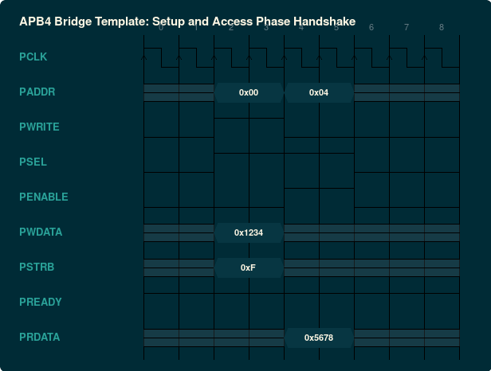

### `rtl/apb_reg_file.sv.inja`: Synthesizable APB4 Register Slave Wrapper
- **Standard / Target**: AMBA 4 APB (APB4 v2.0)
- **Category**: RTL Synthesizable Hardware
- **Default Deliverable Path**: `{out_dir}/{name}_apb.sv`
- **Description**: AMBA 4 APB synthesizable bridge wrapping the generic register file with setup and access phase state logic, byte strobing, and error responses.

#### Generic Parameters & Configurations

| Parameter | Type | Default | Description |
| :--- | :--- | :--- | :--- |
| `ADDR_WIDTH` | `int` | `32` | APB address width in bits |
| `DATA_WIDTH` | `int` | `32` | APB data width in bits |

#### Interface Signals & Ports

| Signal Name | Direction | Type / Width | Description |
| :--- | :--- | :--- | :--- |
| `pclk` | INPUT | `logic` | APB bus clock |
| `presetn` | INPUT | `logic` | Active-low APB reset |
| `paddr` | INPUT | `logic [ADDR_WIDTH-1:0]` | APB byte address |
| `psel` | INPUT | `logic` | APB slave select |
| `penable` | INPUT | `logic` | APB enable strobe |
| `pwrite` | INPUT | `logic` | 1 = Write transaction; 0 = Read |
| `pwdata` | INPUT | `logic [DATA_WIDTH-1:0]` | APB write data |
| `pstrb` | INPUT | `logic [DATA_WIDTH/8-1:0]` | APB write byte strobes |
| `pready` | OUTPUT | `logic` | APB ready acknowledgement |
| `prdata` | OUTPUT | `logic [DATA_WIDTH-1:0]` | APB read data |
| `pslverr` | OUTPUT | `logic` | APB slave error (unmapped address / decode error) |

#### Protocol Timing Diagrams (WaveDrom)

##### AMBA 4 APB: Two-Phase Write and Read Bus Transactions



<details><summary>WaveDrom JSON Source (Timing Specification)</summary>

```wavedrom
{
  "signal": [
    {
      "name": "PCLK",
      "wave": "p........"
    },
    {
      "name": "PADDR",
      "wave": "x.=.=.x..",
      "data": [
        "0x00",
        "0x04"
      ]
    },
    {
      "name": "PWRITE",
      "wave": "0.1.0.0.."
    },
    {
      "name": "PSEL",
      "wave": "0.1.1.0.."
    },
    {
      "name": "PENABLE",
      "wave": "0.0.1.0.."
    },
    {
      "name": "PWDATA",
      "wave": "x.=.x....",
      "data": [
        "0x1234"
      ]
    },
    {
      "name": "PSTRB",
      "wave": "x.=.x....",
      "data": [
        "0xF"
      ]
    },
    {
      "name": "PREADY",
      "wave": "1........"
    },
    {
      "name": "PRDATA",
      "wave": "x...=.x..",
      "data": [
        "0x5678"
      ]
    }
  ],
  "head": {
    "text": "APB4 Bridge Template: Setup and Access Phase Handshake"
  }
}
```
</details>
