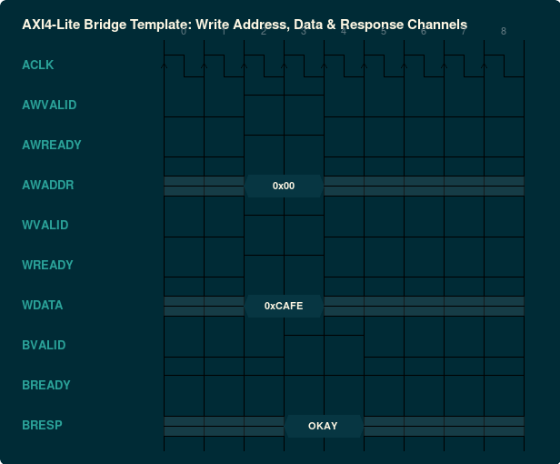

### `rtl/axil_reg_file.sv.inja`: Synthesizable AXI4-Lite Register Slave Wrapper
- **Standard / Target**: AMBA 4 AXI4-Lite
- **Category**: RTL Synthesizable Hardware
- **Default Deliverable Path**: `{out_dir}/{name}_axil.sv`
- **Description**: AMBA 4 AXI4-Lite synthesizable slave wrapper implementing 5 independent handshake channels (AW, W, B, AR, R) around the generic register file.

#### Generic Parameters & Configurations

| Parameter | Type | Default | Description |
| :--- | :--- | :--- | :--- |
| `ADDR_WIDTH` | `int` | `32` | AXI address bus width in bits |
| `DATA_WIDTH` | `int` | `32` | AXI data bus width in bits |

#### Interface Signals & Ports

| Signal Name | Direction | Type / Width | Description |
| :--- | :--- | :--- | :--- |
| `s_axi_aclk` | INPUT | `logic` | AXI clock |
| `s_axi_aresetn` | INPUT | `logic` | Active-low AXI reset |
| `s_axi_awaddr` | INPUT | `logic [ADDR_WIDTH-1:0]` | Write address |
| `s_axi_awvalid` | INPUT | `logic` | Write address valid |
| `s_axi_awready` | OUTPUT | `logic` | Write address ready |
| `s_axi_wdata` | INPUT | `logic [DATA_WIDTH-1:0]` | Write data bus |
| `s_axi_wstrb` | INPUT | `logic [DATA_WIDTH/8-1:0]` | Write byte strobes |
| `s_axi_wvalid` | INPUT | `logic` | Write data valid |
| `s_axi_wready` | OUTPUT | `logic` | Write data ready |
| `s_axi_bresp` | OUTPUT | `logic [1:0]` | Write response (2'b00 = OKAY) |
| `s_axi_bvalid` | OUTPUT | `logic` | Write response valid |
| `s_axi_bready` | INPUT | `logic` | Write response ready |
| `s_axi_araddr` | INPUT | `logic [ADDR_WIDTH-1:0]` | Read address |
| `s_axi_arvalid` | INPUT | `logic` | Read address valid |
| `s_axi_arready` | OUTPUT | `logic` | Read address ready |
| `s_axi_rdata` | OUTPUT | `logic [DATA_WIDTH-1:0]` | Read data output |
| `s_axi_rresp` | OUTPUT | `logic [1:0]` | Read response (2'b00 = OKAY) |
| `s_axi_rvalid` | OUTPUT | `logic` | Read data valid |
| `s_axi_rready` | INPUT | `logic` | Read data ready |

#### Protocol Timing Diagrams (WaveDrom)

##### AMBA AXI4-Lite: Five-Channel Handshake Transactions



<details><summary>WaveDrom JSON Source (Timing Specification)</summary>

```wavedrom
{
  "signal": [
    {
      "name": "ACLK",
      "wave": "p........"
    },
    {
      "name": "AWVALID",
      "wave": "0.1.0...."
    },
    {
      "name": "AWREADY",
      "wave": "0.1.0...."
    },
    {
      "name": "AWADDR",
      "wave": "x.=.x....",
      "data": [
        "0x00"
      ]
    },
    {
      "name": "WVALID",
      "wave": "0.1.0...."
    },
    {
      "name": "WREADY",
      "wave": "0.1.0...."
    },
    {
      "name": "WDATA",
      "wave": "x.=.x....",
      "data": [
        "0xCAFE"
      ]
    },
    {
      "name": "BVALID",
      "wave": "0..1.0..."
    },
    {
      "name": "BREADY",
      "wave": "1........"
    },
    {
      "name": "BRESP",
      "wave": "x..=.x...",
      "data": [
        "OKAY"
      ]
    }
  ],
  "head": {
    "text": "AXI4-Lite Bridge Template: Write Address, Data & Response Channels"
  }
}
```
</details>
