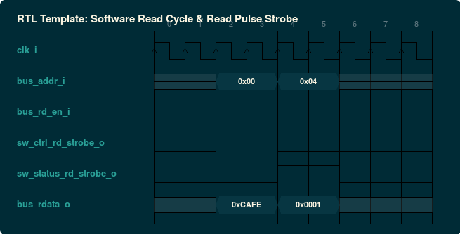
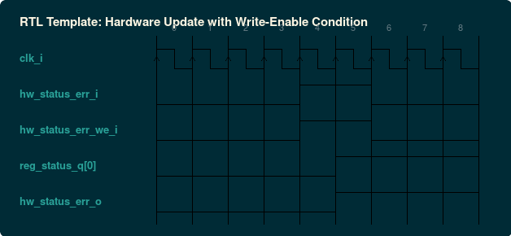
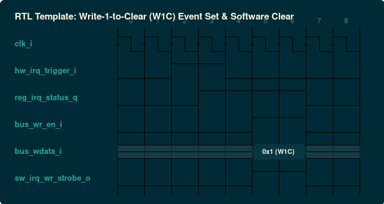

### `rtl/reg_map.sv.inja`: Synthesizable SystemVerilog Register File
- **Standard / Target**: IEEE 1800-2017 SystemVerilog
- **Category**: RTL Synthesizable Hardware
- **Default Deliverable Path**: `{out_dir}/{name}.sv`
- **Description**: Bus-agnostic generic slave register file conforming to ASIC/FPGA HDL coding guidelines with 2-space indentation and clean synchronous resets.

#### Generic Parameters & Configurations

| Parameter | Type | Default | Description |
| :--- | :--- | :--- | :--- |
| `DATA_WIDTH` | `int` | `32` | Register bus data width (8, 16, 32, 64, 128, 256, 512, 1024) |
| `ADDR_WIDTH` | `int` | `32` | Address bus width matching block address range |
| `PARAM_HW_PRECEDENCE` | `bit` | `1'b1` | Arbitration priority: 1 = HW update over SW write; 0 = SW over HW |

#### Interface Signals & Ports

| Signal Name | Direction | Type / Width | Description |
| :--- | :--- | :--- | :--- |
| `clk_i` | INPUT | `logic` | System clock |
| `rst_ni` | INPUT | `logic` | Active-low asynchronous/synchronous reset |
| `bus_addr_i` | INPUT | `logic [ADDR_WIDTH-1:0]` | Register word address |
| `bus_wdata_i` | INPUT | `logic [DATA_WIDTH-1:0]` | Write data bus |
| `bus_wstrb_i` | INPUT | `logic [DATA_WIDTH/8-1:0]` | Byte-level write enables |
| `bus_wr_en_i` | INPUT | `logic` | Write strobe enable |
| `bus_rd_en_i` | INPUT | `logic` | Read strobe enable |
| `bus_rdata_o` | OUTPUT | `logic [DATA_WIDTH-1:0]` | Read data bus output |
| `sw_<reg>_wr_strobe_o` | OUTPUT | `logic` | 1-cycle pulse strobe asserted when software writes to register |
| `sw_<reg>_rd_strobe_o` | OUTPUT | `logic` | 1-cycle pulse strobe asserted when software reads from register |
| `sw_<reg>_<fld>_wr_strobe_o` | OUTPUT | `logic` | 1-cycle pulse strobe asserted when software writes to field |
| `sw_<reg>_<fld>_rd_strobe_o` | OUTPUT | `logic` | 1-cycle pulse strobe asserted when software reads from field |
| `hw_<reg>_<fld>_i` | INPUT | `logic [WIDTH-1:0]` | Hardware input data for RW/WO fields |
| `hw_<reg>_<fld>_we_i` | INPUT | `logic` | Hardware write-enable strobe for RW fields |
| `hw_<reg>_<fld>_o` | OUTPUT | `logic [WIDTH-1:0]` | Live register field state observed by hardware logic |

#### Protocol Timing Diagrams (WaveDrom)

##### Software Write Cycle & Pulse Strobe Timing


<details><summary>WaveDrom JSON Source (Timing Specification)</summary>

```wavedrom
{
  "signal": [
    {
      "name": "clk_i",
      "wave": "p........"
    },
    {
      "name": "bus_addr_i",
      "wave": "x.=.=.x..",
      "data": [
        "0x00",
        "0x04"
      ]
    },
    {
      "name": "bus_wdata_i",
      "wave": "x.=.=.x..",
      "data": [
        "0xCAFE",
        "0xBEEF"
      ]
    },
    {
      "name": "bus_wstrb_i",
      "wave": "0.1.1.0.."
    },
    {
      "name": "bus_wr_en_i",
      "wave": "0.1.1.0.."
    },
    {
      "name": "sw_ctrl_wr_strobe_o",
      "wave": "0.1.0...."
    },
    {
      "name": "sw_status_wr_strobe_o",
      "wave": "0...1.0.."
    },
    {
      "name": "reg_ctrl_q",
      "wave": "x..=.....",
      "data": [
        "0xCAFE"
      ]
    }
  ],
  "head": {
    "text": "RTL Template: Software Write Cycle with Byte Strobes & Pulse Strobe"
  }
}
```
</details>

##### Software Read Cycle & Pulse Strobe Timing



<details><summary>WaveDrom JSON Source (Timing Specification)</summary>

```wavedrom
{
  "signal": [
    {
      "name": "clk_i",
      "wave": "p........"
    },
    {
      "name": "bus_addr_i",
      "wave": "x.=.=.x..",
      "data": [
        "0x00",
        "0x04"
      ]
    },
    {
      "name": "bus_rd_en_i",
      "wave": "0.1.1.0.."
    },
    {
      "name": "sw_ctrl_rd_strobe_o",
      "wave": "0.1.0...."
    },
    {
      "name": "sw_status_rd_strobe_o",
      "wave": "0...1.0.."
    },
    {
      "name": "bus_rdata_o",
      "wave": "x.=.=.x..",
      "data": [
        "0xCAFE",
        "0x0001"
      ]
    }
  ],
  "head": {
    "text": "RTL Template: Software Read Cycle & Read Pulse Strobe"
  }
}
```
</details>

##### Hardware Logic Update with Write-Enable Condition



<details><summary>WaveDrom JSON Source (Timing Specification)</summary>

```wavedrom
{
  "signal": [
    {
      "name": "clk_i",
      "wave": "p........"
    },
    {
      "name": "hw_status_err_i",
      "wave": "0...1.0.."
    },
    {
      "name": "hw_status_err_we_i",
      "wave": "0...1.0.."
    },
    {
      "name": "reg_status_q[0]",
      "wave": "0....1..."
    },
    {
      "name": "hw_status_err_o",
      "wave": "0....1..."
    }
  ],
  "head": {
    "text": "RTL Template: Hardware Update with Write-Enable Condition"
  }
}
```
</details>

##### Concurrent Software vs. Hardware Arbitration Precedence


<details><summary>WaveDrom JSON Source (Timing Specification)</summary>

```wavedrom
{
  "signal": [
    {
      "name": "clk_i",
      "wave": "p........"
    },
    {
      "name": "bus_wr_en_i (SW)",
      "wave": "0.1.0.1.0"
    },
    {
      "name": "bus_wdata_i",
      "wave": "x.=.x.=.x",
      "data": [
        "0xAA",
        "0xAA"
      ]
    },
    {
      "name": "hw_data_we_i (HW)",
      "wave": "0.1.0.1.0"
    },
    {
      "name": "hw_data_i",
      "wave": "x.=.x.=.x",
      "data": [
        "0x55",
        "0x55"
      ]
    },
    {
      "name": "reg_q (HW_PREC=1)",
      "wave": "x..=.....",
      "data": [
        "0x55 (HW)"
      ]
    },
    {
      "name": "reg_q (HW_PREC=0)",
      "wave": "x......=.",
      "data": [
        "0xAA (SW)"
      ]
    }
  ],
  "head": {
    "text": "RTL Template: Concurrent SW vs. HW Arbitration Precedence"
  }
}
```
</details>

##### Write-1-to-Clear (W1C) Status Flag Latching & Clear



<details><summary>WaveDrom JSON Source (Timing Specification)</summary>

```wavedrom
{
  "signal": [
    {
      "name": "clk_i",
      "wave": "p........"
    },
    {
      "name": "hw_irq_trigger_i",
      "wave": "0.1.0...."
    },
    {
      "name": "reg_irq_status_q",
      "wave": "0..1...0."
    },
    {
      "name": "bus_wr_en_i",
      "wave": "0....1.0."
    },
    {
      "name": "bus_wdata_i",
      "wave": "x....=.x.",
      "data": [
        "0x1 (W1C)"
      ]
    },
    {
      "name": "sw_irq_wr_strobe_o",
      "wave": "0....1.0."
    }
  ],
  "head": {
    "text": "RTL Template: Write-1-to-Clear (W1C) Event Set & Software Clear"
  }
}
```
</details>
