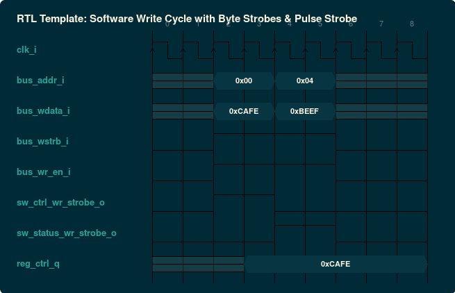
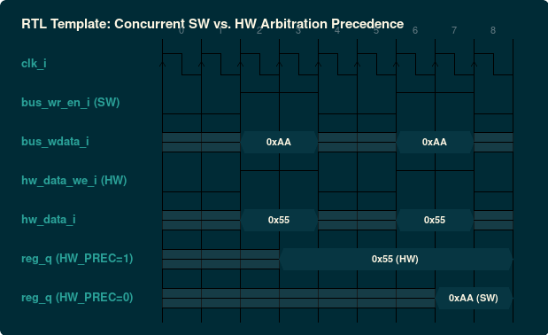

### `rtl/reg_map.v.inja`: Synthesizable Verilog-2001 Register File
- **Standard / Target**: IEEE 1364-2001 Verilog
- **Category**: RTL Synthesizable Hardware
- **Default Deliverable Path**: `{out_dir}/{name}.v`
- **Description**: Legacy synthesizable Verilog implementation for older FPGA toolchains and ASIC synthesis flows with byte strobes and pulse triggers.

#### Generic Parameters & Configurations

| Parameter | Type | Default | Description |
| :--- | :--- | :--- | :--- |
| `DATA_WIDTH` | `integer` | `32` | Register data width in bits |
| `ADDR_WIDTH` | `integer` | `32` | Address width in bits |
| `PARAM_HW_PRECEDENCE` | `integer` | `1` | 1 = Hardware update priority; 0 = Software priority |

#### Interface Signals & Ports

| Signal Name | Direction | Type / Width | Description |
| :--- | :--- | :--- | :--- |
| `clk_i` | INPUT | `wire` | System clock |
| `rst_ni` | INPUT | `wire` | Active-low reset |
| `bus_addr_i` | INPUT | `wire [ADDR_WIDTH-1:0]` | Register address bus |
| `bus_wdata_i` | INPUT | `wire [DATA_WIDTH-1:0]` | Bus write data |
| `bus_wstrb_i` | INPUT | `wire [DATA_WIDTH/8-1:0]` | Byte write strobes |
| `bus_wr_en_i` | INPUT | `wire` | Bus write enable |
| `bus_rd_en_i` | INPUT | `wire` | Bus read enable |
| `bus_rdata_o` | OUTPUT | `wire [DATA_WIDTH-1:0]` | Bus read data |
| `sw_<reg>_wr_strobe_o` | OUTPUT | `wire` | Single-cycle write pulse strobe |
| `sw_<reg>_rd_strobe_o` | OUTPUT | `wire` | Single-cycle read pulse strobe |
| `hw_<reg>_<fld>_i` | INPUT | `wire [WIDTH-1:0]` | Hardware data input |
| `hw_<reg>_<fld>_we_i` | INPUT | `wire` | Hardware write enable |
| `hw_<reg>_<fld>_o` | OUTPUT | `wire [WIDTH-1:0]` | Hardware data output |

#### Protocol Timing Diagrams (WaveDrom)

##### Verilog reg_map: Software Write Cycle with Byte Strobes



<details><summary>WaveDrom JSON Source (Timing Specification)</summary>

```wavedrom
{
  "signal": [
    {
      "name": "clk_i",
      "wave": "p........"
    },
    {
      "name": "bus_addr_i",
      "wave": "x.=.=.x..",
      "data": [
        "0x00",
        "0x04"
      ]
    },
    {
      "name": "bus_wdata_i",
      "wave": "x.=.=.x..",
      "data": [
        "0xCAFE",
        "0xBEEF"
      ]
    },
    {
      "name": "bus_wstrb_i",
      "wave": "0.1.1.0.."
    },
    {
      "name": "bus_wr_en_i",
      "wave": "0.1.1.0.."
    },
    {
      "name": "sw_ctrl_wr_strobe_o",
      "wave": "0.1.0...."
    },
    {
      "name": "sw_status_wr_strobe_o",
      "wave": "0...1.0.."
    },
    {
      "name": "reg_ctrl_q",
      "wave": "x..=.....",
      "data": [
        "0xCAFE"
      ]
    }
  ],
  "head": {
    "text": "RTL Template: Software Write Cycle with Byte Strobes & Pulse Strobe"
  }
}
```
</details>

##### Verilog reg_map: Concurrent SW vs. HW Arbitration



<details><summary>WaveDrom JSON Source (Timing Specification)</summary>

```wavedrom
{
  "signal": [
    {
      "name": "clk_i",
      "wave": "p........"
    },
    {
      "name": "bus_wr_en_i (SW)",
      "wave": "0.1.0.1.0"
    },
    {
      "name": "bus_wdata_i",
      "wave": "x.=.x.=.x",
      "data": [
        "0xAA",
        "0xAA"
      ]
    },
    {
      "name": "hw_data_we_i (HW)",
      "wave": "0.1.0.1.0"
    },
    {
      "name": "hw_data_i",
      "wave": "x.=.x.=.x",
      "data": [
        "0x55",
        "0x55"
      ]
    },
    {
      "name": "reg_q (HW_PREC=1)",
      "wave": "x..=.....",
      "data": [
        "0x55 (HW)"
      ]
    },
    {
      "name": "reg_q (HW_PREC=0)",
      "wave": "x......=.",
      "data": [
        "0xAA (SW)"
      ]
    }
  ],
  "head": {
    "text": "RTL Template: Concurrent SW vs. HW Arbitration Precedence"
  }
}
```
</details>
