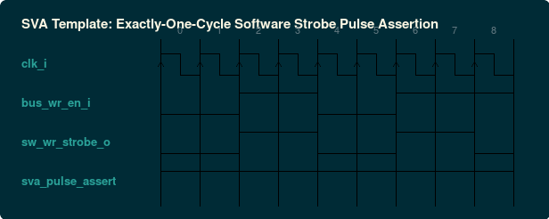

### `rtl/reg_map_sva.sv.inja`: Formal & Dynamic SystemVerilog Assertions (SVA)
- **Standard / Target**: IEEE 1800-2017 SVA
- **Category**: RTL Synthesizable Hardware
- **Default Deliverable Path**: `{out_dir}/{name}_sva.sv`
- **Description**: Formal and simulation SVA assertion module bindable directly to the RTL register file to formally verify strobe invariants, reset integrity, and arbitration rules.

#### Protocol Timing Diagrams (WaveDrom)

##### SVA Verification: Single-Cycle Software Strobe Pulse Assertion



<details><summary>WaveDrom JSON Source (Timing Specification)</summary>

```wavedrom
{
  "signal": [
    {
      "name": "clk_i",
      "wave": "p........"
    },
    {
      "name": "bus_wr_en_i",
      "wave": "0.1.0.1.1"
    },
    {
      "name": "sw_wr_strobe_o",
      "wave": "0.1.0.1.0"
    },
    {
      "name": "sva_pulse_assert",
      "wave": "1........"
    }
  ],
  "head": {
    "text": "SVA Template: Exactly-One-Cycle Software Strobe Pulse Assertion"
  }
}
```
</details>
